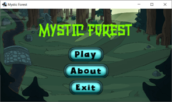
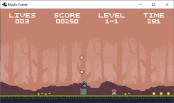
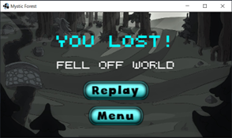

# 159261 - Assignment 2 (Mystic Forest)

Mystic Forest - a Super-Mario inspired side-scrolling 2D plaformer game written in Java. 

Created using:

- Mini2DX/LibGDX as the Java game engine.
- Java as the programming language.
- JetBrains IntelliJ IDEA as the IDE for programming.

Note: This was a group assigment with the following members:

- Saad Billah  
- Lewis Hall 
- [Niamh Ferns](https://github.com/NiamhFerns) 

---

### Massey University Disclaimer

This is a submission for an assignment for the Massey University course 159.261 - Games Programming. Under no circumstances is it to be copied and submitted anywhere as plagiarised work.

--- 

### Assignment Brief

Design and build a computer game in Java as a team. You have the freedom to design and build your own game - a 2D game in Java. You can choose to use GameEngine.java, other available open-source JAVA engines or you may create and use your own engine. The game graphics should include at least some sprites and some animation, the game should have some sound effects (even if it is just background music) and must have a scoring system (gaining and losing scores as a result of some actions). You are welcome to add other additional features (start menu, multi-player, more sophisticated graphics/animation/collision detection etc).

---

### How To Run

1. Ensure the correct JDK version (JDK 8) is installed. 
2. Download the project folder to an appropriate location and unzip.
3. Using a Java-compatible IDE with Gradle enabled, open the folder as a Gradle project. 
4. Build the Gradle project (this can take some time).
5. Once built, locate the DesktopLauncher class (in desktop/src/… folder), right click on it and then press Run from the dropdown menu.
6. *EXTRA*: Alternatively, just double-click on the provided executable jar file, MysticForest.jar, to run the game!

---

### Features

1. A handcrafted world set in a beautiful forest, with a variety of props like flowers, signs, and grass. 
2. Support for multiple screen sizes. 
3. Advanced physics and collision detection—don’t bump into the mushrooms, stomp on them!
4. Multiple characters/entities: the intrepid hooded adventurer and some pesky enemy mushrooms. 
5. Interactive items: collect coins or stomp on mushrooms to score points and reach the door entrance to level up!
6. Upbeat 8-bit music and a substantial collection of 8-bit game sounds.

---

### Design Descisions

1. Went with object oriented design so that program code is well-organized and understandable. 
2. A heads up display to effectively communicate game status, such as how much time is left, or how many lives the player still has.
3. Used a Fit Viewport to preserve the game’s aspect ratio and allow for consistent visual experience on different screen sizes.  
4. User freedom: the user can use both mouse and keyboard to interact with screen buttons, and control the player using W-A-D and arrow keys.
5. Moving the player with linear impulses and using a finite state algorithm ensures smooth player movement.
6. Standard game controls: W-A-D or arrow keys for player movement. This ensures the user doesn’t have to remember which key does what.
7. Personalized game over messages lets users know what caused them to lose the game. 

---

### Screenshots

- Menu screen

- Play screen

- Game over screen

